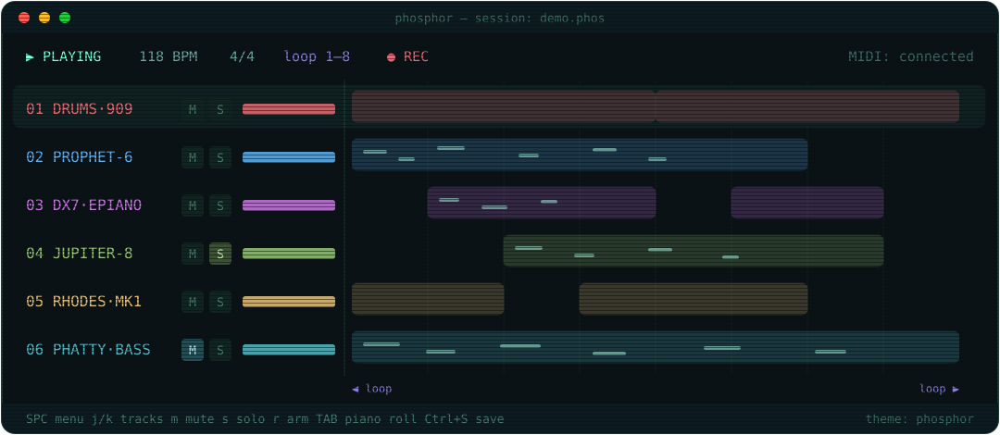

<p align="center">
  
</p>

<p align="center">
  <a href="https://github.com/joshjetson/phosphor/actions/workflows/ci.yml"></a>
  <a href="https://crates.io/crates/phosphor-studio"></a>
</p>

<p align="center">
  <strong>A terminal-native DAW built in Rust</strong><br/>
  8 built-in synthesizers, 18 drum kits, 1,275 patches, 9 color themes, animated splash screen, session save/load, undo/redo, and a plugin system designed for extensibility.
</p>

<p align="center">
  <br/>
  <sub><em>an animated impression of the track view — the real thing runs in your terminal:</em></sub>
</p>

<p align="center">
  
</p>

---

## Index

- [Overview](#overview)
- [Quick Start](#quick-start)
- [Instruments](#instruments)
- [Features](#features)
- [Controls](#controls)
- [Themes](#themes)
- [Architecture](#architecture)
- [Building from Source](#building-from-source)
- [Project Structure](#project-structure)
- [Configuration](#configuration)
- [Contributing](#contributing)
- [License](#license)

---

## Overview

Phosphor is a digital audio workstation that runs entirely in your terminal. It pairs a themeable TUI with a real-time audio engine, giving you a DAW you can use over SSH, in a tiling window manager, or anywhere a terminal lives.

Each instrument track gets its own synthesizer instance with independent parameters. MIDI controllers are detected automatically on startup. The audio engine runs on a dedicated real-time thread with lock-free communication — no mutexes in the audio path, ever.

---

## Quick Start

```bash
# Install from crates.io
cargo install phosphor-studio

# Or clone and build
git clone https://github.com/joshjetson/phosphor.git
cd phosphor
cargo build --release

# Run (TUI is the default)
cargo run --release

# Run with debug logging
PHOSPHOR_DEBUG=1 cargo run --release

# Run without audio (UI development)
cargo run --release -- --no-audio

# Run without MIDI
cargo run --release -- --no-midi
```

**First steps once running:**

1. Press `Space` to open the command menu
2. Press `a` to add an instrument track
3. Select an instrument and press `Enter`
4. Play your MIDI controller — sound comes out
5. Use `j/k` to navigate synth parameters, `h/l` to adjust values — the
   first one is the patch selector
6. Press `Tab` to reach `[inst]`, the instrument's full panel, laid out in
   columns with room for all of it; `Tab` again for the piano roll
7. Press `Space` then `v` to change the color theme

---

## Instruments

### Synthesizers

| Instrument | Type | Voices | Patches | Description |
|-----------|------|--------|---------|-------------|
| **Phosphor Synth** | Wavetable / vector | 8 | **229** | Four oscillators with vector mixing, 16 wavetables, per-oscillator wave sequencing, Moog-style ladder, 6-slot mod matrix, keymapped drum patches |
| **DX7** | FM | 16 | **256** | All 8 original factory cartridges, decoded from the ROM dumps |
| **Jupiter-8** | Analog poly | 8 | **64** | All 64 factory patch names, full 32-control panel, two envelopes |
| **ARP Odyssey** | Duophonic | 2 | 44 | Complete 59-control front panel, all three filter revisions (4023/4035/4075), ADSR *and* AR envelopes, sample and hold |
| **Rhodes** | Physical model | 16 | 26 | Tine and tonebar as a coupled fork, inharmonic cantilever modes, nonlinear magnetic pickup |
| **Juno-60** | DCO poly | 6 | **56** | All 56 factory patches, read off Roland's patch charts; complete 25-control front panel measured against the hardware |
| **Little Phatty** | Mono Moog | 1 | **100** | Continuously morphing oscillators (triangle→saw→square→pulse, band-limited at every position in between), hard sync, 1/2/3/4-pole ladder, pre- and post-filter overload, the one-bus mod matrix with its spare destination, glide, and the three keyboard priorities |
| **Prophet-6** | Analog poly | 6 | **500** | All 500 factory programs, decoded from Sequential's own SysEx. Morphing oscillators with a triangle sub, resonant high-pass *and* SSM2040-lineage low-pass in series, poly mod (filter envelope and oscillator 2 into oscillator 1's frequency, shape and width and into both filters, at audio rate), per-oscillator slop, unison with chord memory, aftertouch, analog distortion |

### Drum Rack

| Kit | Character |
|-----|-----------|
| **808** | Rebuilt on the service-notes circuit values — 49.4 Hz bridged-T kick, 238/476 Hz snare, one shared free-running six-oscillator metal bank |
| **909** | The hybrid it really is — analog kick/snare/toms/rim/clap, and hi-hat, ride and crash as 6-bit 18 kHz samples |
| **707** | A PCM machine, not an analog one — sampled character through post-converter analog envelopes |
| **606** | Its own seven analog voices, built from the service-notes component values |
| **777** | 808/909 bass + creative FM/ring-mod/wavefolder sounds |
| **tsty-1** | Warm vintage, tape-saturated, reel-to-reel character |
| **tsty-2** | Acoustic modal — Bessel membrane modes, multi-phase envelopes |
| **tsty-3** | 88 unique sounds — every note a distinct synthesis |
| **tsty-4** | Extended hats/snares with long decays, varied synthesis methods |
| **tsty-5** | Resonator-based — impulse exciter into tuned bandpass filters, wire-coupled snares |
| **LinnDrum** | 15 recordings through a mu-255 companded 8-bit converter; tuning is the read clock, so pitch and length move together |
| **DMX** | 11 recordings making 15 sounds, companded 8-bit, per-card pitch trimmer at half an octave |
| **SDS-V** | Five analog modules — triangle VCO, noise and click through a 4-pole SSM2044, ramp VCAs that stop rather than fade |
| **727** | The 707's converter with the Latin voice set: congas, bongos, timbales, agogo, cabasa, maracas, whistles, quijada, star chime |
| **CR-78** | Pre-808 Roland analog — a snare with no oscillator in it at all, one LC band-pass for every metal voice, and the metallic beat |
| **jazz** | Live acoustic drums, modelled — a small bebop kit: sealed 18" kick with the two heads coupled through the shell, thin heads left to ring, a dark 20" ride, and brushes |
| **funk** | The same physics, a different drummer — 22" ported kick with a felt strip, a cranked snare over twenty tight strands, gel on the toms, and a ride with a ping |
| **studio** | Very dry and gated — a pillow in the kick that all but closes the two-head coupling, a muffling ring on the snare, taped toms, and a downward expander across every voice |

### Patch Highlights

**DX7** (256 voices): every voice from the eight original factory cartridges —
ROM1A/1B, ROM2A/2B, ROM3A/3B, ROM4A/4B — decoded from the ROM sysex dumps rather
than recreated. That includes the ones that defined the instrument: `E.PIANO 1`,
`BASS    1`, `TUB BELLS`, `BRASS   1`, `STRINGS 1`, `HARPSICH 1`, and the novelty
voices Yamaha shipped alongside them (`TAKE OFF`, `WASP STING`, `..GOTCHA..`).
Pick a cartridge with the `bank` parameter, then a voice with `patch`.


**Jupiter-8** (64 patches): the factory bank in Roland's own 8x8 numbering — `11 NEG SYNC`,
`13 JUICY FUNK`, `15 CARS SYNC`, `17 HAMMER LEAD`, `24 MELLOW RHODES`, `31 LO STRINGS`,
`45 PIPE ORGAN`, `51 TRAIN CHUG`, `57 TOMITA CHIME`, `63 KLINGONS`, `64 MUSIC OF THE SPHERES`,
`66 SOLAR WINDS`, `71 FAT FIFTHS`, `87 UPRIGHT BASS` and the rest. Names, numbers, voice modes
and character follow the original factory patch sheets; the parameter values are voiced to match
Roland's published description of each patch.


**Odyssey** (44 patches): Bass, Funk, Sync Lead, Bells, Pad, S&H, Zap, Hawkshaw Funk, Bennett Atmos, Numan Cars, Sci-Fi Wobble, Percussive Pluck, Thick Lead, Filter Sweep, Noise Hit, Duo Split, Snare Drum, Kick, Resonance, Squelch, Growl, Wind, Wah Bass, Stab, Buzz, Flute, Tremolo, Siren, Brass, Organ, Conga, Tom, Clap, PWM Bass, Violin, Oboe, Choir, Trombone, Marimba, Alarm, Robot, Whistler, Sitar, Theremin

**Juno-60** (56 factory patches, in the instrument's own seven banks of eight):

- **Bank 1** — 11 Strings 1, 12 Strings 2, 13 Strings 3, 14 Organ 1, 15 Organ 2, 16 Organ 3, 17 Brass, 18 Phase Brass
- **Bank 2** — 21 Piano 1, 22 Piano 2, 23 Celesta, 24 Mellow Piano, 25 Harpsichord 1, 26 Harpsichord 2, 27 Guitar, 28 Synthesizer Harp
- **Bank 3** — 31 Bass 1, 32 Bass 2, 33 Clavichord 1, 34 Clavichord 2, 35 Pizzicato Sound 1, 36 Pizzicato Sound 2, 37 Xylophone, 38 Glockenspeil
- **Bank 4** — 41 Violine, 42 Trumpet, 43 Horn, 44 Tuba, 45 Flute, 46 Clarinet, 47 Oboe, 48 English Horn
- **Bank 5** — 51 Funny Cat, 52 Wah Brass, 53 Phase Combination, 54 Reed 1, 55 Popcorn, 56 Reed 2, 57 Reed 3, 58 PWM Chorus
- **Bank 6** — 61 Synthesizer Organ, 62 Effect Sound 1, 63 Effect Sound 2, 64 Space Harp, 65 Funk, 66 Space Sound 1, 67 Mysterious Invention, 68 Space Sound 2
- **Bank 7** — 71 Percussive Sound 1, 72 Percussive Sound 2, 73 Whistle, 74 Effect Sound 3, 75 UFO, 76 Space Sound 3, 77 Surf, 78 Synthesizer Drum — the bank whose sound source is the VCF oscillating on its own

Names and spellings are Roland's, Glockenspeil included.

**Little Phatty** (100 patches, ours rather than Moog's — the Stage II's factory
*names* are printed in its manual but no published source gives the parameter
values behind them, so the bank is original and named in our own voice, weighted
towards bass the way the real one is):

- **Moog bass** — Taurus Deep, Sub Anchor, Round Bass, Bass Pillar, Thumb Bass, Wood Bass, Rubber Bass, Octave Bass, Muted Bass, Fifth Bass, Tri Sub, Pulse Bass, Sine Floor, Dub Weight, Slide Bass, Sequence Lo, Fat Unison, Bass Bloom
- **Overload** — Growl Bass, Tarmac, Coal Face, Snarl, Fuzz Anchor, Grit Stack, Overdriven, Bark Bass, Diesel, Torn Paper, Anvil Bass, Bad Weather
- **Sync** — Sync Lead, Sync Scream, Sync Sweep, Hard Reset, Sync Bell, Sync Buzz, Sync Whistle, Sync Stab
- **Lead** — Solo Saw, Reed Lead, Glass Lead, Whistle Top, Portamento, Brass Lead, Ribbon Lead, Flute Solo, Nasal Lead, Octave Lead, Vox Lead, Cut Lead
- **Wave morph** — Morph Drift, Half Saw, Between, Wave Wash, Slow Morph, Pulse Width, PWM Strings, Thin Ice, Wave Chase, Shape Shift, Morph Bass, Tri To Saw
- **Sample and hold, and effects** — Random Steps, Sample Hold, Computer, Alarm, Siren, Radio Chirp, Wind Tunnel, Static, Bleep Bloop, Sonar
- **Slope** — 2 Pole Bass, 1 Pole Pad, Open Ladder, Leaky, Bright 12dB, 6dB Lead, Half Ladder, Slope Swap
- **Pluck and percussion** — Zap Pluck, Clav Pluck, Wood Block, Kick Drum, Tom Hit, Blip, Marimba, Snap Bass, Dry Tick, Bell Pluck
- **Drone** — Self Osc, Slow Swell, Held Tone, Deep Drone, Air Pad, Ghost Pad, Filter Wash, Long Fifth, Choir Mono, Night Hum

**Rhodes** (26 patches, by instrument rather than by factory number — a Rhodes
has no patch memory):

- **Mark I** — MK1 Stage, MK1 Bright, MK1 Mellow, MK1 Bark, MK1 Ballad, MK1 Funk, MK1 Bass
- **Suitcase** — SC Classic, SC Tremolo, SC SlowTrem, SC Deep, SC Warm, SC 88
- **Mark II** — MK2 Stage, MK2 Tight, MK2 Dark, MK2 Suitcase
- **Dyno** — Dyno, Dyno Bell, Dyno Ballad, Dyno Bright
- **Character** — Bell Tine, Hard Bark, Soft Silk, Woody, Growl Bass

**Prophet-6** (all 500 factory programs, decoded from Sequential's own SysEx
release rather than recreated, in the instrument's five banks of one hundred):
`Brassed Off`, `Thick Low Brass`, `Jupiter Bass`, `Old School House Org`,
`TwinCity Kitty`, `Slow S&H Pad`, `It's a Prophet...6!`, `Oberheim`,
`JarreHead`, `Saw Sync Lead`, `Vox Felicities`, `War of the Worlds`,
`Wub Acid`, `Circus Triangles`, `Prophet Six String`, `Mass Effect`,
`T8 Piano` and the rest — including the forty `P5` programs, Sequential's own
ports of the original Prophet-5 factory bank. Pick a bank with `bank`, a
program with `program`.

---

## Features

**Audio Engine**
- Real-time audio via cpal (CoreAudio, WASAPI, ALSA)
- Lock-free audio thread — zero allocations, zero mutexes in the hot path
- Per-track instrument instances with independent processing
- Per-track and master VU metering via atomic shared state, on a dB scale
- Follows the output device: renders natively at whatever sample rate and block
  size the device is already set to, so nothing is resampled on the way out.
  `--sample-rate` and `--buffer-size` override it on request, and a device that
  refuses says so rather than letting the engine drift out of tune with the
  stream
- Gain-staged for chords, not single notes — every instrument is sized so a
  two-handed voicing at full velocity still has headroom
- Soft saturation on each instrument, transparent below its knee, replacing the
  hard clip that used to turn loud chords into a square wave
- Stereo-linked master limiter at -1 dBFS with a non-finite guard, so nothing
  above full scale and no NaN can ever reach the audio device

**Synthesizers**
- **Phosphor Synth**: the house synth, and the one instrument here that models nothing — the best ideas from three machines instead. Four oscillators mixed on a vector square, each an analog shape or one of 16 generated wavetables; a four-pole Moog-style ladder that self-oscillates and keeps its bass loss; a driven mixer ahead of it; two LFOs, two envelopes and a six-slot modulation matrix of eleven sources against ten destinations. Each oscillator can also be handed a **wave sequence** — a step list of waveform, length, crossfade, pitch and level that it walks on its own clock, the Wavestation's defining trick — so the timbre evolves rhythmically with no envelope doing it. Patches can be keymapped, so a single patch holds a whole drum kit built from the same oscillators and filter as the pads
- **DX7**: all 256 original factory voices, decoded from the ROM cartridge dumps and played on a 6-operator engine modelled on the YM21280/YM21290 chipset — all 32 algorithms decoded from the hardware table (including the multi-operator feedback loops in algorithms 4 and 6), log-domain envelopes with the hardware rate curve and its distinct attack shape, coarse/fine/detune frequency on the real parameter grid, keyboard level and rate scaling, global LFO with six waveforms and two-stage delay, and a per-voice pitch envelope
- **Jupiter-8**: the full front panel — dual VCOs with sync and exponential cross-modulation, switchable 12/24 dB IR3109 filter with resonance to self-oscillation, non-resonant HPF, two independent ADSR envelopes, LFO with four waveforms and a two-stage delay, portamento, and 4 voice modes (Solo/Unison/Poly1/Poly2). Envelope times follow Roland's published 1 ms-10 s specification; filter corners, LFO taper and keyboard follow are measured rather than approximated
- **ARP Odyssey**: the full front panel — two VCOs with coarse and fine tuning over the panel's 20 Hz-2 kHz range, hard sync, per-oscillator pulse width and PWM, two frequency-mod inputs each, a keyboard switch that drops VCO-1 into the LFO range, the sample-and-hold mixer with its own sources, clock and lag, an XOR ring modulator sharing a fader with white or pink noise, all three filter revisions (12 dB 4023 SVF / 24 dB 4035 ladder / 24 dB 4075 Norton) on one 16 Hz-16 kHz sweep and each resonating to self-oscillation, a non-resonant HPF, three filter modulation slots, VCA gain and drive, and both envelope generators — the ADSR and the AR — with their own sliders and their own LFO-repeat gating. Envelope times follow ARP's published 5 ms-10 s specification and the pitch pads are mapped to pitch bend and the modulation wheel
- **Juno-60**: the full front panel — LFO rate/delay, DCO with PWM depth and a 3-position PWM mode (LFO/MANUAL/ENV), saw/pulse/sub/noise and a 16'/8'/4' range switch, 4-position HPF, IR3109-style 24 dB/oct resonant VCF with env polarity, LFO and keyboard follow, ENV/GATE VCA, shared ADSR, and BBD stereo chorus (I / II / I+II). Envelope taper, LFO rate taper, filter corner frequencies and chorus rates are calibrated against measurements of the hardware rather than approximated. All 56 factory patches are the instrument's own, transcribed from Roland's published patch charts
- **Rhodes**: a physical model rather than a sample set, because velocity on a Rhodes changes the *spectrum* and a layered sample set is three photographs of that. A hammer strikes a tine — a steel cantilever, so its overtones are inharmonic, at 6.27, 17.5, 34.4 and 56.8 times the fundamental — and those overtones die far faster than the fundamental does, which is why the attack is a bell and the sustain is almost a pure tone. The tine is paired with a tonebar in an asymmetric tuning fork, so the sustain undulates as energy crosses between them. Sustain per register comes from measured Q values on a 1974 Mark I, interpolated rather than fitted: E flat 2 at 3.88 s, E flat 3 at 1.50, E flat 4 at 1.56, E flat 5 at 1.11, E flat 6 at 0.45 — not monotonic, and left that way. The bark is the pickup: the coil senses the flux gradient where the tine happens to be, and that gradient is an odd function of the tine's offset from the pickup axis, so **voicing** — moving the tine's rest position, the adjustment a technician actually makes — takes the fundamental and every odd partial away and leaves the second partial dominant, exactly as the literature describes. Struck harder the tine swings further into that nonlinearity, so velocity changes the timbre through the pickup rather than through a brightness knob. Felt dampers on release, none above the sixth octave as on the real action, sustain pedal, and the Suitcase's stereo tremolo — which is a pan between two amp channels, not an amplitude modulation
- **Prophet-6**: six voices of the whole front panel, and **all 500 factory programs**, decoded from `P6_Programs_v1.01.syx` — Sequential's own SysEx release of July 2015 — and shipped as 63 KB of the instrument's own bytes with a documented byte map, the way the DX7's cartridges are. Neither manual publishes an offset table and no open-source Prophet-6 editor exists, so the map was established against the bank itself; three of its modulation-destination bits are corrections to the obvious reading, and the argument for each is at `raw_offset`. Per voice: two oscillators that morph continuously triangle→sawtooth→pulse with the pulse width symmetric about the square, a triangle sub-oscillator an octave under oscillator 1, white noise, hard sync (oscillator 1 is the slave), oscillator 2's low-frequency and keyboard switches, and an independent slow random walk per oscillator per voice for slop. Two resonant filters in series — a 2-pole high-pass and a 4-pole low-pass in the **SSM2040 lineage of the Rev 1 and Rev 2 Prophet-5, not a Moog ladder**: its resonance stage is compensated, so where the Little Phatty's ladder loses 15.5 dB of bass at full resonance this one gains 6.5, a 22 dB gap that is measured against the ladder in the rack rather than asserted. One filter envelope with an independent bipolar amount and velocity switch at each filter, an amplifier envelope, and an LFO whose five shapes carry the manual's own polarity (triangle and random bipolar, sawtooth and square positive only) and reach audio rate. **Poly mod** is the section this instrument exists for: the filter envelope and oscillator 2 as bipolar sources into oscillator 1's frequency, waveshape and pulse width and into both filter cutoffs, all at the sample rate, so oscillator 2 into the low-pass really is audio-rate filter modulation. Unison stacks one to six voices with chord memory; the six key-assign modes; aftertouch to six destinations; analog stereo distortion with rails rather than a makeup gain; and Effect A and Effect B in series carrying the OS 1.0 effect lists, of which the two delays and the chorus render and the phasers and reverbs are stored, selectable and passed through until the effects milestone connects them

- **Little Phatty**: the Stage II's whole front panel, plus the eight per-preset parameters Moog put in its Advanced Preset menus. The headline is the **wave control**: each oscillator morphs continuously from triangle through sawtooth through square to a skinny pulse, and the positions between the four labelled shapes are real waveforms rather than crossfades of two others — the oscillator is one trapezoid whose rise, top, fall and bottom move with the knob, band-limited by polyBLAMP at all four corners, and WAVE is a modulation destination because it is voltage-controlled on the hardware. Hard sync with a sub-sample-accurate reset; a transistor ladder whose slope switches between 6, 12, 18 and 24 dB/octave by tapping the ladder rather than shortening it, so a two-pole Phatty still resonates as players describe; pre- and post-filter asymmetric overload with the documented +6 dB at full; two ADSRs with the three gate modes (legato on, legato off, envelope reset); a pitch wheel whose two directions are ranged independently; the one-bus modulation matrix with its six sources, four destinations and the secondary destination the menu adds; constant-rate glide measured against the manual's own five-seconds-across-the-keyboard figure; low, high and last-note keyboard priority; and velocity on the filter and nowhere else, which is most of why an LP feels the way it does. Every range is the manual's — 20 Hz to 16 kHz cutoff (audibly darker than a vintage Moog's, as Sound On Sound notes), 1 ms to 10 s envelopes, 0.2 Hz to 500 Hz LFO, ±7 semitones on oscillator 2
- **Drum Rack**: 18 kits — circuit-accurate 808/909/707/606/727/CR-78, companded-PCM LinnDrum and DMX, the analog SDS-V, the creative 777, the warm tape-saturated tsty series, and three **live acoustic kits** that are physics rather than voicing. An acoustic kick is two membranes coupled through the air inside the shell, and that coupling — not a filter — is what puts two low modes a sixth apart where a drum machine has one; the front head's muffling is a knob that moves the interval between them. The snare's strands are a bouncing-contact model, so they choke on a hard backbeat and ring on after the drum instead of being a noise burst under an envelope. Cymbals are banks of forty complex resonators with frequency gating, so hitting one harder brings in modes that were not there at all, and with a modal cascade that carries energy from the low modes up into the high ones — bow, bell and edge are one plate struck in three places, and a hi-hat is two plates that clamp

**Session Management**
- Save/load projects as `.phos` files (human-readable JSON)
- `Ctrl+S` quick save, `Space+S` save as, `Space+O` open
- Saves all tracks, instruments, synth parameters, clips, MIDI notes, transport settings
- A kit, a patch or a cartridge is stored by **which one it is**, not by where its
  knob sat: a knob position only names a patch while the bank is the size it was
  when the session was written, and reopening on a different instrument is the
  kind of wrong that looks perfectly reasonable
- Atomic writes prevent file corruption
- Default save directory: `sessions/` when you are running from a checkout,
  otherwise `<app dir>/sessions/` — see [Where files live](#where-files-live)

**User Presets**
- `Space+W` opens a preset browser for the selected instrument
- Every instrument has its own bank, the drum rack included — the whole parameter
  block, including the factory patch it was dialled in from
- One human-readable file per instrument (`<app dir>/presets/<instrument>.json`),
  atomic writes, so a DX7 preset can never be offered to a Juno
- Presets sit beside the factory tables rather than extending them, so adding one
  cannot move a patch index stored in a saved session
- A preset saved against a different panel — wrong instrument, wrong number of
  controls, or an older layout — is refused rather than loaded into the wrong holes
- A kit, a patch or a cartridge is stored by **which one it is**, the same as a
  session stores it, so a preset saved on the 909 opens on the 909 after the rack
  has grown a kit rather than on whatever now sits at that fraction of the knob
- 128 presets per instrument, 32 characters per name

**Undo/Redo**
- `u` undoes the last action, `Ctrl+R` redoes
- Works for: note draw/remove, highlight delete, paste, clip delete, track delete
- Full track restoration on undo (instruments, params, clips, audio routing)
- 100-action undo stack

**Themes**
- 9 built-in color themes (see [Themes](#themes))
- `Space+V` cycles themes instantly
- Theme choice persists across sessions (`<app dir>/config.json`)

**MIDI**
- Auto-detection of MIDI controllers on startup
- Lock-free SPSC ring buffer for MIDI-to-audio routing
- Sample-accurate MIDI event processing
- Note-on/off, CC, pitch bend support
- Per-track MIDI routing — only the selected track receives input
- Overdub recording with loop-based merge

**TUI**
- Animated splash screen with shimmering aquamarine/violet dot-matrix art
- 9 color themes with full UI coverage
- Vim-style navigation (j/k/h/l, Enter, Esc)
- Space menu (spacevim-inspired leader key)
- Per-track color coding, VU meters, mute/solo/arm controls
- Synth parameter panel with real-time adjustment and patch selection
- Instrument config tab for deeper parameter access
- Piano roll with horizontal scroll, playhead, column/row highlighting
- Note-level edit mode with per-note select, move, transpose, and stretch
- Variable-strength quantize (25–100%) with grid resolution selection
- Clip locking with move, stretch, trim, and collision detection
- Transport with BPM, loop region, metronome, recording
- Send A/B buses and master track
- Clean terminal restore on exit and panic

**Architecture**
- Workspace of eight crates — seven libraries and the `phosphor-studio` binary — with a clean dependency graph
- Modular file structure — app, UI, and state split into focused sub-modules
- Shared domain models via atomics (no locks between threads)
- Command channel pattern for UI-to-audio communication
- Plugin trait for instruments and effects — same interface for built-in and third-party
- 873 tests covering DSP, MIDI, engine, mixer, navigation, and persistence, run on Linux, macOS and Windows in CI

---

## Controls

### Global

| Key | Action |
|-----|--------|
| `Space` | Open command menu |
| `Ctrl+C` | Quit |
| `Ctrl+S` | Quick save session |
| `u` | Undo last action |
| `Ctrl+R` | Redo |
| `Tab` | Cycle between panes / tabs |
| `Esc` | Back / close menu / clear highlights |

### Space Menu

| Key | Action |
|-----|--------|
| `Space` `1` | Focus transport |
| `Space` `2` | Focus tracks |
| `Space` `3` | Focus clip view |
| `Space` `p` | Play / pause |
| `Space` `0` | Stop and return to bar 1 |
| `Space` `r` | Toggle recording |
| `Space` `l` | Edit loop region |
| `Space` `m` | Toggle metronome |
| `Space` `!` | Panic — kill all sound |
| `Space` `a` | Add instrument track |
| `Space` `s` | Save project |
| `Space` `o` | Open project |
| `Space` `d` | Delete selected track/clip (with confirmation) |
| `Space` `e` | Enter edit mode (note-level piano roll editing) |
| `Space` `q` | Quantize notes to grid |
| `Space` `w` | Instrument presets — save / load / delete |
| `Space` `v` | Cycle color theme |
| `Space` `h` | Open help topics |

### Preset Browser (Space+W, on an instrument track)

| Key | Action |
|-----|--------|
| `j` / `k` | Navigate rows |
| `Enter` on the top row | Name and save the current panel |
| `Enter` on a preset | Load it into the track |
| `d` | Delete the selected preset (`y`/`n`) |
| `Esc` | Close the browser |

Every instrument has its own bank, including the drum rack — the 35 controls behind
a kit are exactly what a factory table cannot hold. A preset is the whole parameter
block as it stands, including the factory patch it was dialled in from, so loading
one puts the panel back exactly where it was.

Names are slots: saving under a name the bank already holds rewrites that preset,
after a confirmation, rather than adding a second row you cannot tell from the first.
128 presets per instrument, 32 characters per name.

A preset saved for a different instrument, with a different number of controls, or
against an older panel layout is **refused** rather than loaded — a block that does
not fit the panel would produce a plausible sound that is not the one that was saved.
The reason appears in the status bar.

The kit, the patch and the cartridge are stored by which one they are rather than by
where the knob sat, for the same reason a session stores them that way: a knob
position only names a patch while the bank is the size it was when the preset was
written, and a preset that reopens on a different drum machine is the kind of wrong
that looks perfectly reasonable. Presets written before this still load — the knob
position is the only evidence they carry — and the status bar says to check the
patch when one does.

### Step Sequencer (a track type — drives any instrument)

A pattern sequencer in the TR/Elektron lineage. It makes no sound of its own:
it drives a **child instrument** — the drum rack by default, or any synth in
the rack — and it is sample-locked to the transport, so a pattern step and a
clip note on the same beat land on the same sample.

**First beat in thirty seconds:**

1. `Space` `a` → **Step Sequencer** → `Enter`. You land on the grid.
2. `n` writes a hit. `h`/`l` move along the steps. Write a few.
3. `j`/`k` move between the rows — the kit's sounds (`BD` `SD` `CH`…), or a
   synth's eight voices. Write a hat line against the kick.
4. `t` — it plays. A light chases across every row and wraps.
5. `Space` `0` stops and returns to bar 1.

**The screen:**

```
 ▶ step 7 of 16  slot A · Drum Rack        ← what the machine is doing
     1  2  3  4   5  6  7  8   9 10 …      ← step ruler, grouped by beat
 BD ▓▓ ░░ ░░ ░░  ▓▓ ░░ ░░ ░░  ▓▓ ░░       ← one row per sound; ▓▓ hit,
▸SD ░░ ░░ ░░ ░░  ██ ░░ ░░ ░░  ░░ ░░          ██ accent, ▸ = row being written
 CH ░░ ░░ ▓▓ ░░  ░░ ░░ ▓▓ ░░  ░░ ░░
lane SD   sound ◑ SD 38  mute ○ off …      ← the row's own controls
pattern   child ○ Drum Rack  steps ◑ 16 …  ← the pattern's controls
  slots  ▶A  B  C  D  E  F  G  H  chain —  ← eight patterns, queue, chain
```

`j`/`k` walk down the rows and keep going into the panels below — lane,
pattern, slots — and `k` walks back up. `h`/`l` move along whatever row you
are on. `n` writes a step; `Enter` **opens** whatever the cursor is standing
on — the row's panel on a kit, the step's panel on a synth — and `Enter`
again **holds** the knob under it (like the volume fader): while held,
`h`/`l` adjust it, `H`/`L` take bigger strides, `Esc` lets go.

**Changing which sounds the rows play.** The eight rows start as kick, snare,
hats, clap and toms, but every kit has more — rimshot, crash, ride, cowbell,
percussion. Walk `j` down to the **lane** panel, `Enter` on the `sound` knob,
then `h`/`l` step through every sound in the kit one at a time (`H`/`L` jump
an octave of notes at once). The row's name follows the sound — `BD` becomes
`RS`, `CR`, `RD`, `CB`… (a sound with no short name shows its note number).
`Esc` releases. The pattern keeps playing while you do this.

**Sequencing a synth instead of drums.** Walk `j` to the **pattern** panel.
Its first knob is `child` — the instrument this sequencer drives. `Enter`,
then `h`/`l` cycle through everything in the rack: the DX7, the Jupiter-8,
the Prophet-6, the Phatty, all of them. The rows become eight voices —
`L1` through `L8` — and the panel above the pattern row becomes the **step**
panel:

- `pitch` — what the step plays. `h`/`l` walk semitones, `H`/`L` jump
  octaves. With a **mode** active (see below) `h`/`l` walk scale degrees
  instead, and the readout shows both: `iii·E4`.
- `chord` — from a single note through maj/min/dim/sus/6ths/7ths/quartal
  4ths, plus **diatonic** (the chord quality follows the scale degree).
- `voicing` — close, drop-2, first or second inversion; `root↓` doubles the
  root an octave down.
- `gate` — how long the note holds, up to **TIE**, which holds it into the
  next step (the 303 slide feel).

The readout line under the step panel always names what the step will play:
`Cm7 · C4 D#4 G4 A#4`. The child's own panel (patch, cutoff, everything)
stays on the left side of the screen — pick the patch there as usual.

**Layering chords across the rows.** The eight rows are eight independent
voices on the same step, which is how you build a chord the chord table has
no name for: put a `maj7` on `L1`, walk `j` to `L2`, write the same step and
run its pitch up to the ninth — now the step plays a five-note ninth chord.
Each row keeps its own pitch, chord, voicing and gate, and `m`/`s` mute or
solo one of them while the rest keep playing.

**Mode and key** (pattern panel): choose Dorian, Phrygian, Lydian… and a
tonic, and the pitch knob snaps to the scale; chords set to *diatonic* pick
their own quality per degree, so a progression stays in key by itself.

**Accent and feel** (pattern panel): `a` on a step makes it hit at the
`accent` velocity instead of `base`. `swing` delays the off-beats,
MPC-style. `steps` masks rather than deletes — shorten 16 → 8 and the hidden
half comes back when you lengthen again. `rate` runs from quarters to
sixteenth triplets; 12 or 24 steps give 3/4 and shuffle feels.

**Patterns, slots, chains** (slots row): eight patterns per sequencer, `A`
through `H`. `h`/`l` choose one to look at, digits `1`–`8` jump. `Enter`
queues the slot to take over **at the end of the current pattern** — the
header counts it down. `c` chains the slot under the cursor (press again for
×2, ×3…), building an arrangement like `A×4 B×2 A×2`; the chain plays in
order and loops. `C` clears it. `y`/`p` copy a pattern from one slot to
another.

**Bounce** (`b`): compiles the pattern — or the whole chain — into a real
clip on the timeline at the next free bar, and stops the live pattern so
nothing plays twice. The clip is then ordinary: edit it in the piano roll,
undo it with `u`.

**Step record** (`r`): arm it and play your MIDI keyboard — each key writes
its pitch to the step under the cursor and moves on; hold several keys and
the step gets the chord, named in the readout. `.` writes a rest (skips a
step), `_` ties the previous step. `r` again to disarm.

**All keys, in one place:**

| Key | Where | Action |
|-----|-------|--------|
| `h` / `l` | everywhere | Move along steps / knobs / slots; adjust a held knob |
| `j` / `k` | everywhere | Down / up: the rows, then lane, pattern, slots panels |
| `n` | grid | Write / erase the step under the cursor |
| `a` | grid | Accent it |
| `Enter` | grid | Open the panel for what is under the cursor · panels: hold the knob · slots: queue |
| `H` / `L` | held knob | Big strides (octaves, ±5 swing, ±10 velocity…) |
| `[` / `]` | everywhere | Previous / next sound row, from any depth |
| `x` | everywhere | Clear the step under the cursor |
| `m` / `s` | everywhere | Mute / solo the row being written |
| `t` | everywhere | Play — while stopped it always starts everything; while playing it mutes/unmutes this pattern |
| `r`, `.`, `_` | everywhere | Step record: arm · rest · tie |
| `b` | everywhere | Bounce pattern or chain to a clip |
| `c` / `C` | everywhere | Chain the slot under the cursor (repeat to stack) / clear the chain |
| `y` / `p` | everywhere | Copy / paste a pattern between slots |
| `digits` | grid / slots | Jump to a step / jump to a slot |
| `X` | everywhere | Clear the whole pattern |
| `Esc` | everywhere | Release knob → leave panel → leave the sequencer |
| `Space` `p` | global | Play — a fresh pattern runs from birth, so this alone makes sound |
| `Space` `0` | global | Stop and return to bar 1 |

### Tracks Pane

| Key | Action |
|-----|--------|
| `j` / `k` | Navigate between tracks |
| `Enter` | Select track (shows synth controls) |
| `h` / `l` | Navigate track elements (fx, vol, mute, solo, arm, clips) |
| `m` | Toggle mute |
| `s` | Toggle solo |
| `r` | Toggle record arm |
| `R` | Toggle loop record |
| `1-9` | Jump to clip by number |

### Volume Fader (navigate to `vol` with `h/l`, then `Enter` to lock)

| Key | Action |
|-----|--------|
| `Enter` | Lock the fader |
| `h` / `l` | Down / up by 1 dB |
| `Esc` / `Enter` | Release the fader |

The fader reads out in dB relative to unity — `0` at unity, `+6` at the top, `-oo` at
the bottom. New tracks start at `-2`. Unity is not the maximum: there is 6 dB of
makeup gain above it, which is where to reach when a quiet patch needs to sit forward
in a mix.

### Clip Operations (navigate to a clip with `h/l`, then `Enter` to lock)

| Key | Action |
|-----|--------|
| `Enter` | Lock to clip (enables move/stretch controls) |
| `h` / `l` | Move clip left/right by one beat |
| `H` / `Shift+Left` | Shrink clip (right edge moves left) |
| `L` / `Shift+Right` | Extend clip (right edge moves right) |
| `Ctrl+H` / `Ctrl+Left` | Trim left edge (start moves right) |
| `Ctrl+L` / `Ctrl+Right` | Extend left edge (start moves left) |
| `y` | Yank (copy) clip |
| `p` | Paste clip after current clip |
| `P` | Paste clip to same position on another track |
| `d` | Duplicate clip (copy + paste next to it) |
| `Esc` | Unlock clip (back to element navigation) |

Clip operations include collision detection — clips cannot overlap. Moving, stretching, and trimming all respect adjacent clip boundaries. Note positions are automatically rescaled when stretching or trimming to preserve their absolute timeline positions. All changes sync to the audio thread in real time.

### Instrument Panel (`[inst]` tab)

The instrument's own controls, laid out in as many columns as the pane has
room for — three at 120 columns, which is what makes an 84-control panel like
the Prophet-6 readable. The first control is always the patch selector.

| Key | Action |
|-----|--------|
| `j` / `k` | Move between controls (down each column, then over) |
| `h` / `l` | Turn the control under the cursor — a knob by a step, a selector to the next position |
| `Tab` | Next tab (piano roll) |
| `Esc` | Back to the tracks pane |

It is the same panel as the narrow `[synth]` strip on the left and the same
cursor, so moving in either moves in both; the tab simply has the room. A
patch selector reloads the whole panel, and every value of it reaches the
audio thread.

### Piano Roll — Navigation Mode

| Key | Action |
|-----|--------|
| `h` / `l` | Navigate between columns (beats) |
| `j` / `k` | Scroll up/down through notes |
| `1-9` | Jump to column by number |
| `Enter` | Select column (enter edit mode) |
| `n` | Toggle note at cursor (draw or remove) — on an empty track this makes the clip, and the status bar says so |
| `Esc` | Clear highlights or exit piano roll |

### Piano Roll — Column/Row Highlighting

| Key | Action |
|-----|--------|
| `Shift+H` / `Shift+Left` | Start/expand column highlight left |
| `Shift+L` / `Shift+Right` | Start/expand column highlight right |
| `Shift+J` / `Shift+Down` | Start/expand row highlight down |
| `Shift+K` / `Shift+Up` | Start/expand row highlight up |
| `d` | Delete notes in highlighted region |
| `y` | Yank (copy) notes in highlighted region |
| `p` | Paste yanked notes at cursor/highlight position |
| `j` / `k` (without shift) | Clear row highlight and move |

### Piano Roll — Column Selected (Right Left Trick)

| Key | Action |
|-----|--------|
| `h` / `l` | Adjust left edge of all notes in column |
| `H` / `L` | Adjust right edge of all notes in column |
| `j` / `k` | Enter row mode (select individual note) |
| `n` | Draw note at cursor position |
| `Esc` | Back to navigation mode |

### Piano Roll — Row Mode (Single Note)

| Key | Action |
|-----|--------|
| `h` / `l` | Adjust left edge of single note |
| `H` / `L` | Adjust right edge of single note |
| `j` / `k` | Move between notes in column |
| `n` | Draw note / toggle note |
| `Esc` | Back to column mode |

### Piano Roll — Edit Mode (Space+E)

Note-level editing. Where the Right Left Trick operates on whole columns, edit mode moves a cursor between individual notes.

**Navigate**

| Key | Action |
|-----|--------|
| `j` / `k` | Move to next note up/down within the same column |
| `h` / `l` | Jump to nearest note in previous/next column |
| `Enter` | Select cursor note for moving |
| `d` | Delete cursor note |
| `u` | Undo |
| `Esc` / `e` | Exit edit mode |

**Select** (triggered by `Shift`+direction from navigate)

| Key | Action |
|-----|--------|
| `Shift+J` / `Shift+K` | Extend selection up/down within the column |
| `Shift+H` / `Shift+L` | Extend selection to previous/next column |
| `d` | Delete all selected notes |
| `h` / `j` / `k` / `l` | Begin moving the selection |
| `Esc` | Clear selection, back to navigate |

**Move** (after selecting, or `Enter` on a single note)

| Key | Action |
|-----|--------|
| `h` / `l` | Move selected notes left/right by one grid step |
| `j` / `k` | Transpose selected notes down/up by a semitone |
| `Shift+H` / `Shift+L` | Stretch the right edge (duration) |
| `Shift+J` / `Shift+K` | Stretch the left edge (start position) |
| `d` | Delete all selected notes |
| `Esc` | Lock notes in place, clear selection |

### Quantize (Space+Q)

Opens a modal that snaps the selected clip's notes to the grid. Requires a selected clip.

| Key | Action |
|-----|--------|
| `j` / `k` | Move between rows (grid, strength, apply) |
| `h` / `l` | Adjust the selected value |
| `Enter` | Apply quantize (when on the apply button) |
| `Esc` | Close without applying |

Strength runs from 25% to 100%. At 100% notes land exactly on the grid; below that they move proportionally toward it, so you can tighten a performance without flattening its feel. Quantize is a single undoable action — `u` restores the original positions.

### Loop Editor (Space+L)

| Key | Action |
|-----|--------|
| `h` / `l` | Move loop start left/right |
| `H` / `L` | Move loop end left/right |
| `Enter` | Enable/disable loop |
| `Esc` | Exit loop editor |

### Transport (Space+1)

| Key | Action |
|-----|--------|
| `h` / `l` | Navigate transport elements |
| `Enter` | Select element (BPM editing, etc.) |
| `+` / `-` | Adjust BPM |

---

## Themes

9 built-in color themes, cycle with `Space+V`:

| Theme | Description |
|-------|-------------|
| **Phosphor** | Original solarized-dark blue-teal (default) |
| **SpaceVim** | Charcoal background with bright gold accents |
| **Gruvbox** | Warm retro browns and oranges |
| **Midnight** | Deep navy with cool blue and violet |
| **Dracula** | Classic purple/pink/cyan dark theme |
| **Nord** | Arctic polar night with frost blue/teal |
| **Jellybean** | True black with soft pastel accents |
| **Catppuccin** | Mocha variant with mauve/pink/sky pastels |
| **SpaceVim2** | Authentic SpaceVim colorscheme (from SpaceVim.vim) |

Theme choice is saved to `<app dir>/config.json` and persists across sessions.

---

## Where files live

Everything phosphor owns — presets, the theme preference, and sessions you have
not given a path of your own — sits in one directory:

| Platform | Application directory |
|---|---|
| macOS, Linux, BSD | `$HOME/.phosphor` |
| Windows | `%APPDATA%\phosphor`, falling back to `%USERPROFILE%\AppData\Roaming\phosphor` |

Set `PHOSPHOR_HOME` to put it somewhere else — a portable install on a USB
stick, or a scratch directory while you are experimenting. It names the
directory itself, not a parent.

Inside it:

```
<app dir>/config.json                    theme preference
<app dir>/presets/<instrument>.json      one user preset bank per instrument
<app dir>/sessions/                      sessions saved without a path
```

The save and open prompts start in `sessions/` when the working directory has
one — running from a checkout, which is where the sessions in this repository
already are — and in the absolute `<app dir>/sessions/` otherwise. Opening a
relative path looks in the working directory first and then under the
application directory, so `sessions/take3.phos` keeps working from anywhere.

---

## Architecture

```
                    UI Thread                              Audio Thread
                    ---------                              ------------
                    NavState                               Mixer
                      |                                      |
                      +-- TrackState --Arc<TrackHandle>--> AudioTrack
                      |    muted ---> TrackConfig.muted      |
                      |    soloed --> TrackConfig.soloed      +-- instrument: Box<dyn Plugin>
                      |    volume --> TrackConfig.volume      +-- buf_l / buf_r
                      |    VU <----- TrackHandle.vu <------- +-- per-track VU
                      |
                      +-- MixerCommand --crossbeam--> Mixer.drain_commands()
                           AddTrack                     -> tracks.push()
                           SetInstrument                -> track.instrument = Some(plugin)
                           SetParameter                 -> plugin.set_parameter()

MIDI Controller --midir--> MidiRingSender --SPSC--> MidiRingReceiver
                                                        |
                                                   EngineAudio.process()
                                                        |
                                                   Mixer.process()
                                                        |
                                                   cpal audio callback --> speakers
```

---

## Building from Source

### Requirements

- Rust 1.75+ (install via [rustup](https://rustup.rs))
- System audio libraries:
  - **macOS**: CoreAudio (included with Xcode)
  - **Linux**: ALSA for the DAW itself (`sudo apt install libasound2-dev pkg-config`);
    building the whole workspace also wants the GUI stub's windowing headers
    (`libudev-dev libxkbcommon-dev libwayland-dev libgl1-mesa-dev`) — the exact
    list CI uses is in `.github/workflows/ci.yml`
  - **Windows**: WASAPI (included)
- MIDI support requires a connected MIDI device (optional)

### Build

```bash
cargo build --release
```

### Test

```bash
cargo test --workspace  # 873 tests
```

---

## Project Structure

```
phosphor/
├── Cargo.toml                 # Workspace root (phosphor-studio on crates.io)
├── src/main.rs                # CLI entry point
├── sessions/                  # Default save directory for .phos files
├── crates/
│   ├── phosphor-core/         # Audio engine, mixer, transport, metronome
│   ├── phosphor-dsp/          # Built-in instruments
│   │   └── src/
│   │       ├── synth.rs       # Phosphor Synth, wavetable/vector (229 patches)
│   │       ├── dx7.rs         # DX7 FM synthesizer (256 factory voices from the ROMs)
│   │       ├── jupiter.rs     # Jupiter-8 analog poly (64 factory patches)
│   │       ├── odyssey.rs     # ARP Odyssey duophonic (44 patches)
│   │       ├── juno.rs        # Juno-60 DCO + BBD chorus (56 factory patches)
│   │       ├── rhodes.rs      # Rhodes tine piano, modal physical model (26 patches)
│   │       ├── phatty.rs      # Little Phatty mono Moog, morphing oscillators (100 patches)
│   │       ├── prophet6.rs    # Prophet-6 analog poly with poly mod (500 factory programs)
│   │       ├── p6_programs.bin # The factory programs, from Sequential's SysEx
│   │       ├── drum_rack/     # Drum machine (18 kits)
│   │       │   ├── mod.rs     # Shared types, voice, plugin impl
│   │       │   └── racks/     # Per-kit synthesis: 808, 909, 707, 606, 727, CR-78,
│   │       │                  #   LinnDrum, DMX, SDS-V, 777, tsty1-5, and the three
│   │       │                  #   acoustic kits (jazz, funk, studio)
│   │       └── oscillator.rs  # Waveform oscillators
│   ├── phosphor-midi/         # MIDI I/O, message parsing, ring buffer
│   ├── phosphor-plugin/       # Plugin trait definitions
│   ├── phosphor-tui/          # Terminal UI frontend
│   │   └── src/
│   │       ├── app/           # Application logic
│   │       │   ├── mod.rs     # App struct, main loop
│   │       │   ├── keys.rs    # Keyboard event handling
│   │       │   ├── piano_roll.rs  # Note editing, yank/paste
│   │       │   ├── clips.rs   # Clip manipulation (move, stretch, duplicate)
│   │       │   ├── tracks.rs  # Track creation, space actions
│   │       │   ├── transport.rs   # Playback, recording, loop sync
│   │       │   ├── delete.rs  # Delete with confirmation
│   │       │   ├── undo_redo.rs   # Undo/redo system
│   │       │   └── session_io.rs  # Save/load .phos files
│   │       ├── state/         # Navigation state
│   │       │   ├── mod.rs     # NavState struct, accessors
│   │       │   ├── navigation.rs  # Pane focus, movement, tabs
│   │       │   ├── params.rs  # Synth parameter adjustment
│   │       │   ├── track_ops.rs   # Track management, clip recording
│   │       │   ├── clip_view.rs   # Piano roll state, highlights
│   │       │   ├── menu.rs    # Menus, modals, instrument types
│   │       │   ├── undo.rs    # Undo action definitions
│   │       │   └── ...        # Loop editor, transport UI, etc.
│   │       ├── ui/            # Rendering
│   │       │   ├── mod.rs     # Layout orchestration
│   │       │   ├── top_bar.rs # Transport display
│   │       │   ├── tracks.rs  # Track rows, clip grid
│   │       │   ├── clip_view.rs   # Piano roll, FX panel, instrument panel
│   │       │   ├── overlays.rs    # Menus, modals, confirmations
│   │       │   └── bottom_bar.rs  # Key hints
│   │       ├── session.rs     # Session file format
│   │       ├── splash.rs      # Animated splash screen
│   │       └── theme.rs       # 9 color themes
│   └── phosphor-gui/          # GUI frontend (planned)
└── architect.md               # Architecture plan and roadmap
```

---

## Configuration

### CLI Options

```
phosphor [OPTIONS]

Options:
    --tui                 Launch TUI frontend (default)
    --gui                 Launch GUI frontend (not yet implemented)
    --buffer-size <N>     Request an audio block size in samples
    --sample-rate <N>     Request a sample rate in Hz
    --no-audio            Disable audio output
    --no-midi             Disable MIDI input
    -h, --help            Print help
    -V, --version         Print version
```

`--buffer-size` and `--sample-rate` have no defaults on purpose. Left off,
phosphor renders natively at whatever the output device is already set to. Pin
a rate the hardware is not at and the platform quietly inserts a sample-rate
converter in the output path — on macOS the HAL resamples between the audio
unit and the device — so you get conversion artifacts and added latency with
nothing on screen to say so. Ask for a rate and it is used if the device offers
it; if not, the device's own is adopted and the difference is reported on the
status bar rather than left to be discovered by ear. `--no-audio` has no device
to follow and runs at 44100 / 64.

### Debug Logging

```bash
PHOSPHOR_DEBUG=1 cargo run --release
```

Creates `phosphor_debug.log` with timestamped user actions and system responses. Includes a panic handler that captures full backtraces to the log.

It is written to the working directory when that is writable, otherwise to the
application directory, otherwise to the system temp directory; if none of those
will take it, phosphor says so on stderr and carries on without a log. The file
is capped at 8 MB and starts over rather than growing without bound.

### Theme Persistence

Theme selection is saved to `<app dir>/config.json` and automatically loaded on startup.

---

## Contributing

Phosphor uses a modular plugin architecture. The `Plugin` trait in `phosphor-plugin` is the contract for all instruments and effects:

```rust
pub trait Plugin: Send {
    fn info(&self) -> PluginInfo;
    fn init(&mut self, sample_rate: f64, max_buffer_size: usize);
    fn process(&mut self, inputs: &[&[f32]], outputs: &mut [&mut [f32]], midi_events: &[MidiEvent]);
    fn parameter_count(&self) -> usize;
    fn parameter_info(&self, index: usize) -> Option<ParameterInfo>;
    fn get_parameter(&self, index: usize) -> f32;
    fn set_parameter(&mut self, index: usize, value: f32);
    fn reset(&mut self);
}
```

To add a new instrument:

1. Create a struct that implements `Plugin`
2. Add it to `phosphor-dsp` (or your own crate)
3. Add the variant to `InstrumentType` in `phosphor-tui/src/state/menu.rs`
4. Wire it into `create_instrument_track()` in `app/tracks.rs`

---

## License

MIT
